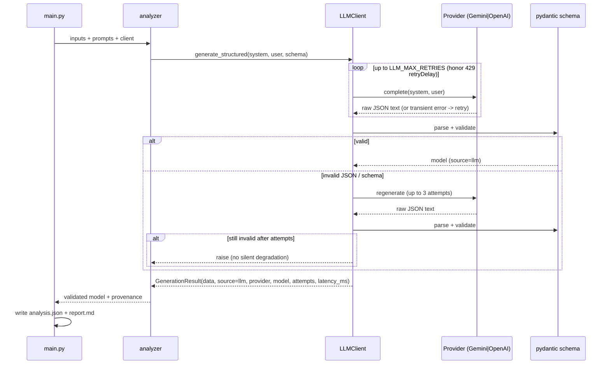

# Architecture

This document describes how the two cases are built, how data flows, and the
key technical decisions. See [PROMPT_ENGINEERING.md](PROMPT_ENGINEERING.md) for
prompt design and [DEMO.md](DEMO.md) for the presentation script.

## Design goals
1. **Real generative AI at the core** of both cases, with explicit prompt
   engineering. Generative AI is mandatory — there is no mock or fallback path.
2. **Resilience without faking it** — retries that honor a 429's
   server-suggested `retryDelay`, regeneration on malformed JSON, and Gemini
   native structured output, with an explicit raise on unrecoverable failure.
3. **Separation of concerns** — business logic depends on an abstraction, never
   on the SDK or on raw JSON parsing.
4. **Validated, contract-bound output** — the model must conform to a typed
   schema; invalid output triggers regeneration, never silent trust or
   degradation.

## Module map

```text
shared/
├── paths.py              # repo-root path resolution (run from any CWD)
└── llm/
    ├── config.py         # LLMConfig from env; provider auto-selection; MissingAPIKeyError
    ├── providers.py      # LLMProvider ABC, GeminiProvider, OpenAIProvider
    ├── client.py         # LLMClient: orchestration + JSON parse + validate + regenerate
    └── logging_utils.py  # namespaced stderr logger (LLM_LOG_LEVEL)

case_1_earnings_tracker/
├── prompts/{system_prompt,user_prompt}.txt   # versioned prompts
├── data/{itub4_q1_2026,itub4_q4_2025,analyst_questions}.txt
├── src/
│   ├── schema.py         # EarningsAnalysis pydantic contract
│   ├── parser.py         # I/O + prompt rendering (clear errors)
│   ├── analyzer.py       # CORE: render -> LLMClient -> validated model
│   ├── report_generator.py  # <=400-word Markdown
│   ├── utils.py          # save_json / save_text helpers
│   └── main.py           # CLI entrypoint (argparse)
└── outputs/{analysis.json,report.md}

case_2_macro_engine/      # same shape
├── prompts/{system_prompt,user_prompt}.txt
├── data/scenario.txt
├── src/{schema,macro_analyzer,report_generator,utils,main}.py
└── outputs/{analysis.json,report.md}

demo.py · Makefile · requirements.txt · .env.example · tests/
```

## Responsibilities

| Layer | Responsibility | Must NOT |
|---|---|---|
| `main.py` | parse args, load files, wire client, write outputs | contain analysis logic |
| `analyzer.py` / `macro_analyzer.py` | render prompts, call `LLMClient`, return validated model | import the SDK, parse JSON |
| `shared/llm/client.py` | pick provider, parse+validate, retry + regenerate, raise on failure | know anything case-specific |
| `providers.py` | talk to Gemini/OpenAI | validate business schema |
| `schema.py` | define + validate the output contract | perform I/O |
| `report_generator.py` | format Markdown within word limits | mutate analysis |

## Data flow (both cases)



## LLM integration details
- **Providers:** `GeminiProvider` (default) calls `client.models.generate_content`
  with native structured output — `response_schema` set to the case's pydantic
  model — which guarantees schema-valid JSON. `OpenAIProvider` (alternative)
  calls `chat.completions` with `response_format={"type": "json_object"}`. Each
  SDK is imported lazily, so tests never require either package.
- **Provider selection:** `config.resolve_provider` — explicit `LLM_PROVIDER`
  wins; else a Gemini key → Gemini; else an OpenAI key → OpenAI; else
  `MissingAPIKeyError` (generative AI is mandatory; there is no mock).
- **Retries:** transient failures retry up to `LLM_MAX_RETRIES` (default 4); a
  429 honors the server-suggested `retryDelay`; exhaustion raises.
- **Parsing:** `_extract_json` handles bare JSON, fenced JSON, and JSON embedded
  in prose.
- **Validation + regeneration:** the parsed object is validated against the
  case's pydantic model. On malformed/invalid JSON the client regenerates up to
  3 times; if all attempts fail it raises (no silent degradation). Only
  validated models reach business code.
- **Testability:** both `GeminiProvider` and `OpenAIProvider` accept an injected
  client, so each real code path is unit-tested with a fake SDK client (no
  network, no key).

## Resilience strategy
Generative AI is mandatory; there is **no** deterministic fallback. Robustness
comes from three layers, with an explicit raise when they are exhausted:
- **Retries** up to `LLM_MAX_RETRIES` (default 4) on transient API errors,
  honoring a 429's server-suggested `retryDelay`.
- **Regeneration** up to 3 times when the response is malformed or fails schema
  validation.
- **Native structured output** on Gemini (`response_schema` = the pydantic
  model), which guarantees schema-valid JSON.

Every result is model-authored and labelled with the runtime banner
`[LLM] provider:model (N attempt(s), X ms)`. If all layers are exhausted the
call **raises** — there is no silent degradation and no mock/fallback path.

## Key decisions & trade-offs
- **Subprocess isolation in `demo.py`.** The two cases intentionally share flat
  module names (`main`, `schema`); running both in one process would collide on
  `sys.path`. `demo.py` runs each case as a subprocess — clean isolation and
  identical to the documented standalone commands.
- **pydantic over hand-rolled checks.** Declarative contract, good errors, and it
  doubles as documentation of the output shape — and, on Gemini, it is the
  `response_schema` that constrains generation directly.
- **Repo-root path resolution.** Fixes the prior "only runs from repo root" bug;
  every entrypoint computes absolute paths via `shared/paths.py`.
