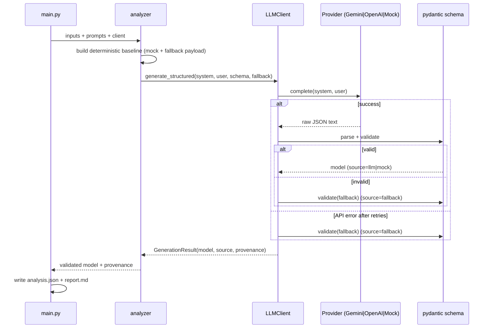

# Architecture

This document describes how the two cases are built, how data flows, and the
key technical decisions. See [PROMPT_ENGINEERING.md](PROMPT_ENGINEERING.md) for
prompt design and [DEMO.md](DEMO.md) for the presentation script.

## Design goals
1. **Real generative AI at the core** of both cases, with explicit prompt
   engineering.
2. **Reproducible without credentials** — a deterministic mock/fallback path so
   a demo never depends on a live API.
3. **Separation of concerns** — business logic depends on an abstraction, never
   on the SDK or on raw JSON parsing.
4. **Validated, contract-bound output** — the model must conform to a typed
   schema; invalid output is repaired via fallback, never silently trusted.

## Module map

```text
shared/
├── paths.py              # repo-root path resolution (run from any CWD)
└── llm/
    ├── config.py         # LLMConfig from env; provider auto-selection
    ├── providers.py      # LLMProvider ABC, GeminiProvider, OpenAIProvider, MockProvider
    ├── client.py         # LLMClient: orchestration + JSON parse + validate + fallback
    └── logging_utils.py  # namespaced stderr logger (LLM_LOG_LEVEL)

case_1_earnings_tracker/
├── prompts/{system_prompt,user_prompt}.txt   # versioned prompts
├── data/{itub4_q1_2026,itub4_q4_2025,analyst_questions}.txt
├── src/
│   ├── schema.py         # EarningsAnalysis pydantic contract
│   ├── baseline.py       # deterministic engine (mock/fallback/sanity only)
│   ├── parser.py         # I/O + prompt rendering (clear errors)
│   ├── analyzer.py       # CORE: render -> LLMClient -> validated model
│   ├── report_generator.py  # <=400-word Markdown
│   └── main.py           # CLI entrypoint (argparse)
└── outputs/{analysis.json,report.md}

case_2_macro_engine/      # same shape
├── prompts/{system_prompt,user_prompt}.txt
├── data/scenario.txt
├── src/{schema,baseline,sector_mapper,macro_analyzer,report_generator,main}.py
└── outputs/{analysis.json,report.md}

demo.py · Makefile · requirements.txt · .env.example · tests/
```

## Responsibilities

| Layer | Responsibility | Must NOT |
|---|---|---|
| `main.py` | parse args, load files, wire client, write outputs | contain analysis logic |
| `analyzer.py` / `macro_analyzer.py` | render prompts, call `LLMClient`, return validated model | import the SDK, parse JSON |
| `shared/llm/client.py` | pick provider, parse+validate, fallback | know anything case-specific |
| `providers.py` | talk to Gemini/OpenAI / emulate offline | validate business schema |
| `schema.py` | define + validate the output contract | perform I/O |
| `baseline.py` / `sector_mapper.py` | deterministic mock/fallback | be presented as GenAI |
| `report_generator.py` | format Markdown within word limits | mutate analysis |

## Data flow (both cases)



## LLM integration details
- **Providers:** `GeminiProvider` (default) calls `client.models.generate_content`
  with `response_mime_type="application/json"`; `OpenAIProvider` (alternative)
  calls `chat.completions` with `response_format={"type": "json_object"}`. Both
  bias the model toward valid JSON. Each SDK is imported lazily, so mock runs and
  tests never require either package.
- **Provider selection:** `config.resolve_provider` — explicit `LLM_PROVIDER`
  wins; else a Gemini key → Gemini; else an OpenAI key → OpenAI; else mock.
- **Retries:** transient failures retry up to `LLM_MAX_RETRIES` with short
  linear backoff; exhaustion raises `LLMError`.
- **Parsing:** `_extract_json` handles bare JSON, fenced JSON, and JSON embedded
  in prose.
- **Validation:** the parsed object is validated against the case's pydantic
  model; only validated models reach business code.
- **Testability:** both `GeminiProvider` and `OpenAIProvider` accept an injected
  client, so each real code path is unit-tested with a fake (no network, no key).

## Fallback strategy
The deterministic baseline is computed **once** and reused as (a) the mock
provider's output and (b) the fallback payload. Therefore:
- mock mode = baseline (labelled `[MOCK]`);
- real mode success = LLM (labelled `[LLM]`);
- real mode failure (API/JSON/schema) with `LLM_ALLOW_FALLBACK=true` = baseline
  (labelled `[FALLBACK]`).

The pipeline thus **always** produces a schema-valid result, and the source is
always explicit — no silent degradation.

## Key decisions & trade-offs
- **Subprocess isolation in `demo.py`.** The two cases intentionally share flat
  module names (`main`, `schema`, `baseline`); running both in one process would
  collide on `sys.path`. `demo.py` runs each case as a subprocess — clean
  isolation and identical to the documented standalone commands.
- **Baseline kept, not deleted.** It is genuinely useful as offline/fallback and
  as a sanity check; the prior audit's concern was that it was *presented as AI*.
  It is now clearly demoted and labelled.
- **pydantic over hand-rolled checks.** Declarative contract, good errors, and it
  doubles as documentation of the output shape.
- **Repo-root path resolution.** Fixes the prior "only runs from repo root" bug;
  every entrypoint computes absolute paths via `shared/paths.py`.
