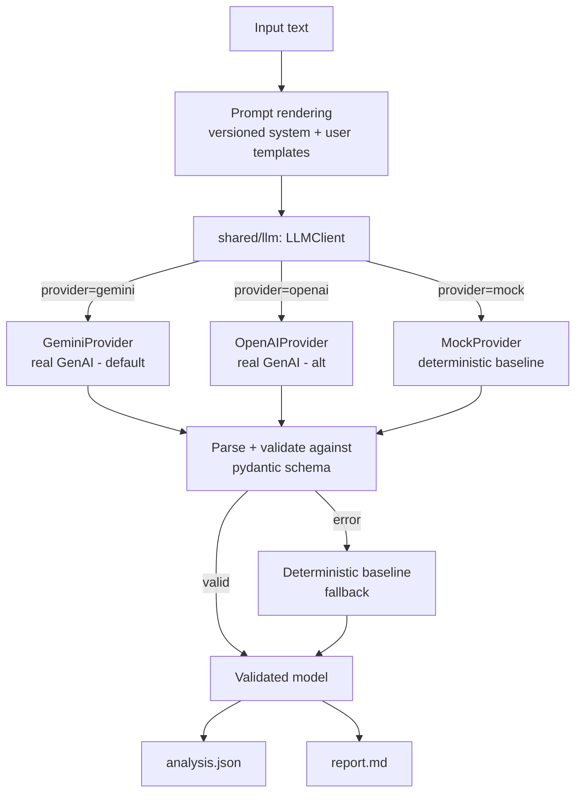

# Bradesco BBI AI Challenge — Equity Strategy Tech/AI Cases

Two Python tools that turn unstructured financial text into structured,
decision-grade equity-strategy intelligence using **generative AI** with
explicit, versioned **prompt engineering**:

- **Case 1 — Earnings Call Intelligence Tracker:** an earnings-call transcript →
  structured analysis (tone with verbatim evidence, guidance changes vs. the
  prior quarter, top analyst questions, linguistic red flags, surprise score) +
  a ≤400-word executive report.
- **Case 2 — Macro Scenario Engine:** a macro scenario in natural language →
  top-5 benefited/hurt sectors with transmission mechanism, 3+3 B3 tickers,
  top-3 thesis risks, confidence score + a ≤500-word report.

> **Reproducible with zero credentials.** With no API key the tools run in a
> deterministic **mock** mode (output derived from the real input) so the demo
> always works. With `GEMINI_API_KEY` set (free tier at
> [Google AI Studio](https://aistudio.google.com/apikey)) the **real**
> generative-AI path runs — `OPENAI_API_KEY` is also supported as an
> alternative. See [Configuration](#configuration).

---

## Table of contents
1. [Problem & use case](#problem--use-case)
2. [What the solution does](#what-the-solution-does)
3. [Architecture](#architecture)
4. [Where generative AI is used](#where-generative-ai-is-used)
5. [Prompt engineering](#prompt-engineering)
6. [Prerequisites](#prerequisites)
7. [Installation](#installation)
8. [Configuration](#configuration)
9. [Running locally](#running-locally)
10. [Demo](#demo)
11. [Tests](#tests)
12. [Troubleshooting](#troubleshooting)
13. [Time log](#time-log)
14. [Prioritization rationale](#prioritization-rationale)
15. [Three most serious limitations](#three-most-serious-limitations)
16. [If I had two more weeks](#if-i-had-two-more-weeks)
17. [Risks](#risks)

---

## Problem & use case

Equity Strategy translates rich-but-unstructured inputs into actionable views.
Two recurring, time-consuming tasks:

- **Earnings calls** (60–90 min) carry guidance, strategy signals and nuanced
  Q&A that consensus takes days to digest. We want the signal in minutes.
- **Macro → sector → ticker** translation is manual: read reports, debate
  transmission channels, land on a sector view. We want a prototype that
  accelerates that translation.

Both tasks are explicitly *Tech/AI*: the challenge evaluates how software
engineering is combined with **generative AI** and **prompt engineering**.

## What the solution does

| | Case 1 | Case 2 |
|---|---|---|
| Input | earnings transcript (+ analyst questions, + optional prior quarter) | macro scenario (free text / file / stdin) |
| Core AI output | tone+evidence, takeaways, guidance, **guidance changes vs. prior quarter**, top-3 analyst Q&A, **verbatim red flags**, **surprise score** | top-5 +/− sectors with transmission mechanism, 3+3 B3 tickers, top-3 risks, confidence |
| Deliverables | `analysis.json` + `report.md` (≤400 words) | `analysis.json` + `report.md` (≤500 words) |

## Architecture

High level (full detail in [ARCHITECTURE.md](ARCHITECTURE.md)):



**Separation of concerns:** business logic (`*/src/analyzer.py`,
`macro_analyzer.py`) depends only on the case-agnostic `shared/llm` layer and
never touches the SDK or parses JSON itself. The rule-based engines
(`baseline.py`, `sector_mapper.py`) are used **only** as mock output, fallback,
and sanity baseline — never presented as generative AI.

### Components
- `shared/llm/` — provider abstraction, config (env), JSON parsing + schema
  validation, retries, deterministic fallback, structured logging.
- `case_1_earnings_tracker/` — Case 1 prompts, schema, baseline, analyzer,
  report generator, entrypoint, data.
- `case_2_macro_engine/` — same structure for Case 2.
- `demo.py`, `Makefile` — one-command runners.
- `tests/` — 55 automated tests (pytest).

## Where generative AI is used

The model performs the **core extraction/reasoning** in both cases:

- **Case 1:** `case_1_earnings_tracker/src/analyzer.py` →
  `shared/llm/client.py::LLMClient.generate_structured` →
  `GeminiProvider.complete` (or `OpenAIProvider.complete`) in
  `shared/llm/providers.py`, using JSON mode and the versioned prompts in
  `case_1_earnings_tracker/prompts/`.
- **Case 2:** `case_2_macro_engine/src/macro_analyzer.py` → same client → same
  provider, with `case_2_macro_engine/prompts/`.

Provenance is explicit at runtime: every run prints `[LLM]`, `[MOCK]`, or
`[FALLBACK]` so you can prove which path produced the answer.

## Prompt engineering

Prompts are **versioned files** (not inline strings), one `system_prompt.txt`
and one `user_prompt.txt` per case, with an explicit JSON output contract and
anti-hallucination rules (grounding, verbatim quotes, "say what you don't
know"). Full rationale, variables, and evolution strategy are documented in
[PROMPT_ENGINEERING.md](PROMPT_ENGINEERING.md).

## Prerequisites
- Python 3.10+ (developed and validated on 3.13).
- `make` (optional; all commands have a plain-Python equivalent).
- A Gemini API key (free tier) **only** for the real GenAI path — or an OpenAI
  key. The demo works without any key.

## Installation

```bash
# from the repository root
python3 -m venv .venv
source .venv/bin/activate          # Windows: .venv\Scripts\activate
pip install -r requirements.txt
# or simply:  make install
```

## Configuration

Copy the template and edit as needed:

```bash
cp .env.example .env
```

| Variable | Default | Purpose |
|---|---|---|
| `LLM_PROVIDER` | auto | `gemini`, `openai` or `mock`. Empty → auto (gemini key → gemini, else openai key → openai, else mock). |
| `GEMINI_API_KEY` | — | Default real path. Free tier at [AI Studio](https://aistudio.google.com/apikey). `GOOGLE_API_KEY` also accepted. |
| `GEMINI_MODEL` | `gemini-2.5-flash` | Gemini model (JSON mode via `response_mime_type`). |
| `OPENAI_API_KEY` | — | Alternative real path. Leave empty to use Gemini/mock. |
| `OPENAI_MODEL` | `gpt-4o-mini` | OpenAI model (JSON mode). |
| `OPENAI_BASE_URL` | — | Optional OpenAI-compatible gateway. |
| `LLM_TEMPERATURE` | `0.2` | Sampling temperature. |
| `LLM_MAX_TOKENS` | `2000` | Max completion tokens. |
| `LLM_MAX_RETRIES` | `2` | Retries on transient API errors. |
| `LLM_ALLOW_FALLBACK` | `true` | Fall back to baseline on failure (recommended for demos). |
| `LLM_LOG_LEVEL` | `INFO` | `DEBUG`/`INFO`/`WARNING`/`ERROR`. |

**No secrets are committed.** `.env` is git-ignored; only `.env.example` (no
keys) is tracked.

## Running locally

Each case runs from anywhere (paths resolve to the repo root):

```bash
# Case 1
python case_1_earnings_tracker/src/main.py
# custom inputs:
python case_1_earnings_tracker/src/main.py --company ITUB4 \
    --transcript case_1_earnings_tracker/data/itub4_q1_2026.txt \
    --prior case_1_earnings_tracker/data/itub4_q4_2025.txt

# Case 2
python case_2_macro_engine/src/main.py
python case_2_macro_engine/src/main.py --scenario case_2_macro_engine/data/scenario.txt
echo "The Selic was cut 200bps amid an easing cycle." | \
    python case_2_macro_engine/src/main.py --stdin
```

Outputs are written to each case's `outputs/{analysis.json,report.md}`.

## Demo

```bash
python demo.py        # both cases   (or: make demo)
python demo.py --case 1
python demo.py --case 2
```

Full presentation script in [DEMO.md](DEMO.md), including how to prove GenAI is
in use and how to switch between mock and real modes live.

## Tests

```bash
pytest -q             # or: make test
make validate         # install + test + demo, end to end
```

55 tests cover: provider selection & precedence (Gemini default), the Gemini and
OpenAI real paths (stubbed, no network), mock path, retries, JSON parsing, schema
validation, fallback, missing-config errors, both end-to-end flows, the report
word limits, and the data files.

## Troubleshooting

| Symptom | Cause | Fix |
|---|---|---|
| `GEMINI_API_KEY is not set` (real mode) | no key | export the key, or `LLM_PROVIDER=mock`. |
| Output says `[FALLBACK]` | LLM call/parse failed | check `LLM_LOG_LEVEL=DEBUG`; output is still valid (baseline). |
| `ModuleNotFoundError: google` / `openai` | deps not installed | `pip install -r requirements.txt`. |
| Report slightly over word limit (real mode) | verbose model | lower `LLM_MAX_TOKENS` or tighten the prompt; the report generator clips defensively. |
| Rate-limit / network errors | API issues | retries kick in; fallback guarantees a result. |

## Time log
_Approximate, honest._

| Activity | Time |
|---|---|
| Reading the case, setup, data prep | ~1.5 h |
| Shared LLM layer (providers, config, validation, fallback) | ~3 h |
| Case 1 (prompts, schema, analyzer, report, bug fixes) | ~3 h |
| Case 2 (prompts, schema, analyzer, report) | ~2 h |
| Multi-provider support (Gemini default + OpenAI) | ~1 h |
| Tests (55) | ~2 h |
| Documentation (this README + 3 docs) | ~2 h |
| **Total** | **~14.5 h** |

## Prioritization rationale

I invested in **both cores equally** and then **deepened Case 1** as the
"extension" case. Reasoning: Case 1 is the harder NLP problem (long transcript,
nuance, grounding, temporal comparison), so it best demonstrates prompt
engineering and anti-hallucination discipline. Concretely, Case 1 received the
extra investment via:
- **Citation tracking** (verbatim evidence + verbatim red-flag quotes);
- **Temporal comparison** (real guidance-change diff vs. a prior quarter);
- a **self-correcting output contract** (schema validation + fallback).

A cross-cutting investment benefiting both: the **multi-mode LLM layer**
(real/mock/fallback) and a **44-test** safety net, which I judged more valuable
for a defensible, demonstrable delivery than adding more thin extensions.

## Three most serious limitations
1. **Single-call extraction for long transcripts.** Case 1 sends the transcript
   in one prompt. Very long calls can exceed context or dilute attention; there
   is no chunk-map-reduce or retrieval step yet. *(Mitigation: the report stays
   terse; full data is in JSON. Not yet solved for >context-window transcripts.)*
2. **Mock/fallback is heuristic, not analytic.** When no key is present (or on
   failure), output comes from keyword rules. It is honest (derived from input,
   labelled `[MOCK]`/`[FALLBACK]`) but less nuanced than the LLM. Reviewers must
   run the real path to judge true output quality.
3. **No grounding verification of model claims.** In real mode we instruct the
   model to quote verbatim, but we do not yet programmatically verify that each
   returned quote is an exact substring of the source. A confident model could
   still paraphrase. *(A verifier is the first item below.)*

## If I had two more weeks
- **Quote-grounding verifier**: assert every evidence/red-flag quote is a literal
  substring of the transcript; reject/repair otherwise (closes limitation 3).
- **Chunk-map-reduce + retrieval** for arbitrarily long transcripts (limitation 1).
- **Self-critique loop**: a second LLM pass that critiques and revises the first.
- **Multi-model comparison**: the provider abstraction already supports Gemini
  and OpenAI; next is running both on the same input and diffing/ensembling the
  answers, plus a confidence-calibration study against realized outcomes (Case 2
  backtest).
- **Streamlit UI** for both cases and a small evaluation harness with gold labels.

## Risks
- **API cost/availability** in real mode → mitigated by Gemini's free tier plus
  mock + fallback.
- **Model drift** across versions → pinned model via `GEMINI_MODEL` /
  `OPENAI_MODEL`; schema validation catches contract breaks.
- **Prompt-injection** from adversarial transcripts → system prompt restricts the
  model to the provided text; not exhaustively hardened (documented risk).

---

Author: Nicoly Santos · License: MIT (see [LICENSE](LICENSE)).
Per-case detail: [Case 1](case_1_earnings_tracker/) · [Case 2](case_2_macro_engine/).
