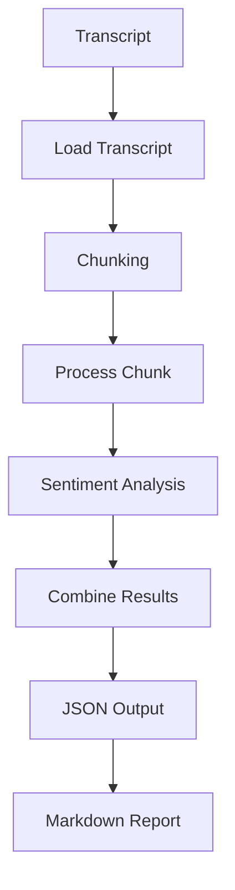

# Bradesco BBI AI Challenge

Project developed as part of the Bradesco BBI AI Challenge.

## Overview

This project aims to analyze earnings call transcripts and transform unstructured financial discussions into structured insights.

The system processes transcripts, identifies management sentiment, extracts key takeaways, highlights potential risks, and generates structured reports.

## Features

* Transcript loading
* Prompt-based analysis workflow
* Text chunking for large documents
* Sentiment classification
* Structured JSON output
* Markdown report generation

## Project Structure

```text
case_1_earnings_tracker/
├── data/
├── outputs/
├── prompts/
└── src/
```

## Pipeline

Transcript → Chunking → Analysis → Aggregation → JSON → Report

## Example Output

```json
{
  "company": "Sample Company",
  "management_tone": {
    "classification": "optimistic",
    "confidence": 0.80
  },
  "key_takeaways": [
    "Revenue increased by 15% year-over-year."
  ],
  "guidance": [
    "Management expects strong performance next quarter."
  ],
  "surprise_score": {
    "score": 6
  }
}
## Technologies

* Python
* Git
* GitHub
* JSON
* Markdown

## Future Improvements

* Integration with LLMs (OpenAI, Claude, Gemini)
* Enhanced sentiment analysis
* Real earnings call transcripts
* Advanced financial insight extraction
