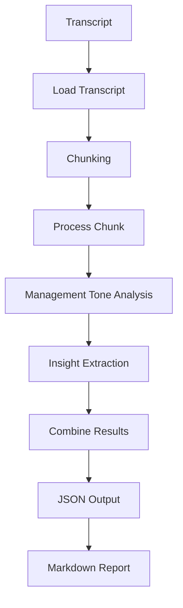

# Bradesco BBI AI Challenge

## Overview

This project was developed as part of the Bradesco BBI AI Challenge.

The objective is to transform unstructured earnings call transcripts into structured financial insights that can support analysts, investors, and decision-makers in understanding company performance and management communication.

The system processes earnings call transcripts, extracts relevant information, identifies management sentiment, summarizes key topics, highlights potential risks, and generates structured outputs in both JSON and Markdown formats.

---

## Features

* Transcript loading and preprocessing
* Text chunking for large documents
* Management tone classification
* Key takeaways extraction
* Guidance detection
* Guidance change tracking structure
* Analyst question extraction
* Response quality assessment
* Red flag identification
* Surprise score generation
* JSON output generation
* Markdown report generation

---

## Project Structure

```text
case_1_earnings_tracker/
├── data/
│   ├── itub4_q1_2026.txt
│   ├── itub4_q2_2026.txt
│   └── analyst_questions.txt
│
├── outputs/
│   ├── analysis.json
│   └── report.md
│
├── prompts/
│   └── analysis_prompt.txt
│
└── src/
    ├── analyzer.py
    ├── parser.py
    ├── report_generator.py
    ├── utils.py
    └── main.py
```

---

## Pipeline

```text
Transcript
    ↓
Load Transcript
    ↓
Chunking
    ↓
Chunk Analysis
    ↓
Sentiment Classification
    ↓
Insight Extraction
    ↓
Aggregation
    ↓
JSON Output
    ↓
Markdown Report
```

### Workflow Diagram



---

## Generated Insights

The system extracts and organizes the following information:

### Management Tone

Classifies management communication as:

* Optimistic
* Neutral
* Pessimistic

Includes supporting evidence and confidence score.

### Key Takeaways

Identifies major topics discussed during the earnings call, such as:

* Profitability
* Revenue trends
* Credit quality
* Portfolio growth
* Operational efficiency

### Guidance

Detects management expectations regarding future performance and strategic outlook.

### Guidance Changes

Provides a structure for comparing management guidance across different quarters.

### Analyst Questions

Captures and organizes relevant analyst questions discussed during the earnings call.

### Response Quality

Summarizes management responses and provides a qualitative assessment.

### Red Flags

Highlights potential areas of concern such as:

* Credit deterioration
* Macroeconomic risks
* Operational challenges
* Uncertainty signals

### Surprise Score

Generates a score from 1 to 10 indicating the relevance or unexpected nature of information discussed during the call.

---

## Example Output

```json
{
  "company": "ITUB4",
  "management_tone": {
    "classification": "optimistic",
    "confidence": 0.8
  },
  "key_takeaways": [
    "Profitability and ROE sustainability were central themes in the call."
  ],
  "guidance": [
    "Management stated it remains comfortable with current guidance."
  ],
  "surprise_score": {
    "score": 5
  }
}
```

---

## Technologies Used

* Python
* Git
* GitHub
* JSON
* Markdown

---

## Current Limitations

* Guidance comparison between quarters is partially implemented.
* Analyst response summaries currently use rule-based extraction.
* Sentiment analysis relies on keyword-based heuristics.
* Earnings call transcripts require manual selection and preprocessing.

---

## Future Improvements

* LLM-powered transcript analysis
* Automatic analyst question extraction
* Multi-quarter comparison engine
* Financial metric extraction
* Company benchmarking
* Interactive dashboard visualization
* Vector database integration for semantic search

---

## How to Run

```bash
python case_1_earnings_tracker/src/main.py
```

Outputs will be generated in:

```text
case_1_earnings_tracker/outputs/
```

Including:

```text
analysis.json
report.md
```
