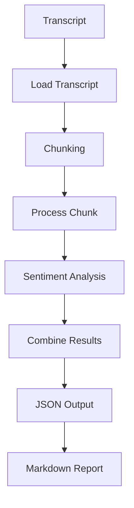

# Bradesco BBI AI Challenge

Project developed as part of the Bradesco BBI AI Challenge.

## Overview

This project aims to analyze earnings call transcripts and transform unstructured financial discussions into structured insights.

The system processes transcripts, identifies management sentiment, extracts key takeaways, highlights potential risks, and generates structured reports.

## Features

* Transcript loading
* Prompt-based analysis workflow
* Text chunking for large documents
* Sentiment classification
* Structured JSON output
* Markdown report generation
* Guidance analysis
* Red flag detection
* Surprise score generation

## Project Structure

```text
case_1_earnings_tracker/
├── data/
├── outputs/
├── prompts/
└── src/
```

## Pipeline

Transcript → Chunking → Analysis → Aggregation → JSON → Report



## Example Output

```json
{
  "company": "Sample Company",
  "management_tone": {
    "classification": "optimistic",
    "confidence": 0.80
  },
  "key_takeaways": [
    "Revenue increased by 15% year-over-year."
  ],
  "guidance": [
    "Management expects strong performance next quarter."
  ],
  "surprise_score": {
    "score": 6
  }
}
```

## Technologies

* Python
* Git
* GitHub
* JSON
* Markdown

## Architecture

The solution follows a modular pipeline architecture:

* `main.py`: orchestrates the workflow
* `parser.py`: transcript ingestion and chunk generation
* `analyzer.py`: sentiment analysis, guidance extraction, red flag detection, and insight generation
* `report_generator.py`: executive report generation in Markdown
* `utils.py`: file persistence and output handling

## Prompt Engineering Decisions

The project uses a structured prompt approach designed to encourage consistent outputs and reduce ambiguity.

Key decisions:

* Explicit JSON schema definition
* Separation between instructions and transcript content
* Evidence-based analysis requirements
* Structured output generation
* Focus on concise executive summaries

Although the current implementation uses rule-based analysis, the prompt architecture was designed to support future LLM integration.

## Time Spent

Approximate time spent:

* Case 1: ~10–12 hours

## Prioritization Rationale

The primary focus was building a complete end-to-end pipeline before pursuing optional extensions.

Priority was given to:

* Modular architecture
* Explainable outputs
* Structured reporting
* Maintainability
* Clear documentation

The objective was to deliver a functional and interpretable prototype rather than maximizing feature count.

## Main Limitations

1. The current sentiment analysis relies on keyword-based rules and does not capture all linguistic nuances.
2. Historical quarter comparisons are not yet automated because only a single transcript is analyzed at a time.
3. Analyst question extraction currently requires transcripts containing dedicated Q&A sections.

## What I Would Add With Two More Weeks

* Integration with GPT or Claude for deeper contextual reasoning
* Automated quarter-over-quarter comparison
* Enhanced analyst Q&A extraction and response-quality scoring
* Citation tracking for all generated insights
* Streamlit interface for interactive analysis
* Comparative analysis across multiple earnings calls

## Future Improvements

* Real earnings call datasets from Ibovespa companies
* Advanced financial insight extraction
* Multi-model evaluation
* Self-critique and consistency validation
* Market reaction analysis